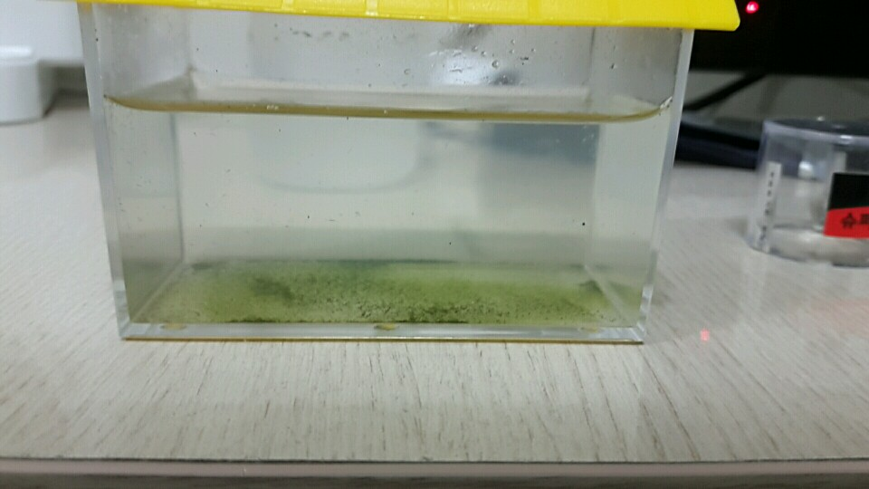

# Gosione
야탑역 고시원 생활 씨몽키 육아일기

## 2016-07-12(화) 고시원 1일차
- jam2in 인턴으로 인해 야탑역 고시원을 얻음. 방 개좁음. 겁나 심심함
- 슬리퍼 사러 다이소 갔다가 내 친구를 구해옴

- 내가 먹으려고 샀던 백산수를 주려고 했으나 주의사항에 수돗물 주라해서 미지근한 수돗물을 3/4 채워줌

- 알이랑 수질정화제라고 써있는 봉투를 넣고 잘 섞어줌

- 뭔가 이끼낀거처럼 초록색 물이됨....
- 하지만 다이소를 믿어보겠음 2~8일 후 부화한다고 함

## 2016-07-13(수) 고시원 2일차

- 별다른 변화 없음
- 첫 출근. 많이 배울 것 같다.. 근데 2달동안 이 좁아터진 고시원... 답답하군

- 씨몽키들은 언제쯤 부화하려나.
- 언넝언넝 나와 놀쟈

## 2016-07-14(목) 고시원 3일차

- 출근 2일차, 고시원 3일차
- 씨몽키들은 여전히 변화가 없다. 뭔가 잘못됐나..? 산소도 잘 주고있는데
- 밥은 부화하면 주는거아닌가..밥을 줘야하나..?
- 내일은 학교 기숙사로간당..얘네 펌프질해줘야하는데.. 하루쯤은 괜찮겠징

- 언넝언넝 모습을 보여라 씨몽키들아!!

## 2016-07-15(목) 고시원 4일차

- 출근 3일차, 고시원 4일차
- 우아..이제 진짜 개발 시작이다. 재밋겠군 껄껄

- 아직 씨몽키들은 변화가 없다... 내일은 펌프질 못해주는데..
- 일요일에 부화해라!! 밥주러갈게!!

##  2016-07-17(일) 고시원 6일차
- 5일차는 학교 다녀옴!
- 고시원으로 복귀해보니 씨몽키 아가들이 탄생해있었다
- 정말 꺠알같이 작다. 신기하다. 무럭무럭 2달동안 크게 키우리라

- 중상 부분에 깨알같은게 씨몽키 아가들!! 겁나 많다..
- 내일은 밥을 줘봐야겠다

##  2016-07-26(화) 고시원 15일차
- 그동안 고시원 인터넷이 잘 안됨... 업데이트 안함
- 그사이에 씨몽키 아가들이 빠염함..
- 밥도 4일에 한번 주고... 산소 아침 저녁으로 주로 뭐가 문제일까
- 2천원짜리라 집이 너무 좁았던거 같다... 이번엔 3천원짜리 넓은집으로 도전
- 새우튀김이 되는 그날까지!!

##  2016-07-27(수) 고시원 16일차
- 우아 오늘은 하루만에 부화했다
- 집이 훨씬 넓으니 좋은가보다
- 산소가 가장 중요하다니 펌프질 자주 잘 해줘야지!

##  2016-07-28(목) 고시원 17일차
- 겁나 활발하게 돌아다니는중
- 약 100여마리 되지 않을까

##  2016-07-31(일) 고시원 20일차
- 토요일 하루 비워서 걱정했는데 너무 잘 지내고있다
- 펌프질 겁나해주고 첫 밥 준날!
- 산소발생기 구입... 시간나면 해야지

##  2016-08-01(월) 고시원 21일차
- 무.럭.무.럭.튼.튼.하.게

##  2016-08-02(화) 고시원 22일차
- 어제 술먹고와서 퇴근후에 못챙겨 줬는데
- 아침에보니 건강하게 잘 있다
- 무엇보다 크기가 확실히 커졌다..
- 아직 카메라에는 잘 안보이지만.. 일주일 후에 방 빼는데..얘네 어떻게 데려가지..

